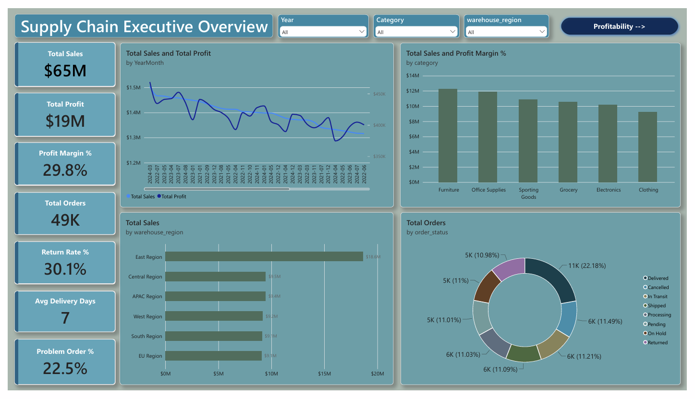
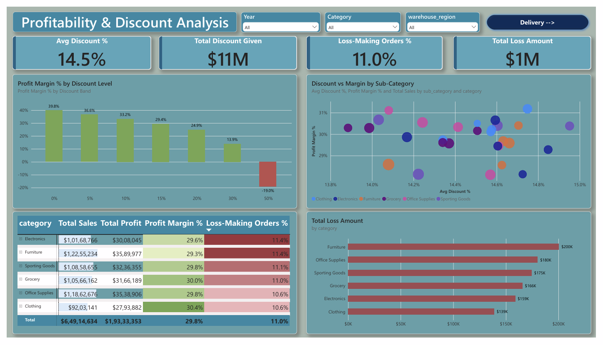
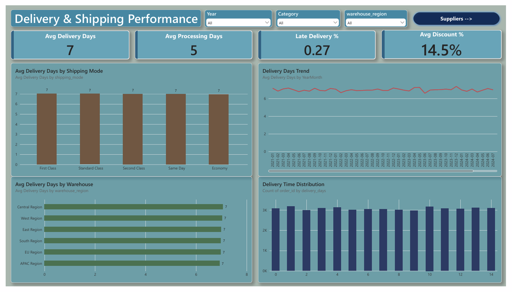
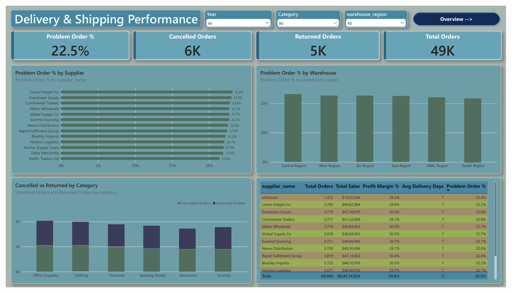

# Supply Chain Analysis Dashboard

An end-to-end analysis of about 50,000 retail supply chain orders. The raw data was cleaned with Python in a Jupyter Notebook, then analysed in a 4-page interactive Power BI dashboard.

## Business Problem

Where does the business make and lose money? How well does shipping perform? What drives cancelled and returned orders? This project answers those questions with a dashboard that an operations or management team could use.

## Dataset

- About 50,000 order records
- Covers orders, customers, products, suppliers, warehouses, shipping and profit
- Key fields: order dates, category and sub-category, discount, sales, cost, profit, shipping mode, processing and delivery days, order status, return flag, supplier and warehouse region

## Tools Used

- **Python (Pandas) and Jupyter Notebook** for data cleaning
- **Power BI Desktop** for the dashboard
- **DAX** for measures and calculated columns

## Data Cleaning

- Standardized the country, state, city and postal code fields
- Replaced invalid or missing location values with "Unknown"
- Left 4-digit postal codes unchanged
- Cleaned the measurement-based columns before loading the data into Power BI

## Dashboard Pages

### 1. Executive Overview


High-level KPIs (total sales, profit, profit margin, orders, return rate, average delivery days and problem order %), the sales and profit trend, sales by category and warehouse region, and the order status breakdown.

### 2. Profitability and Discounts


Shows how discount level affects profit margin, with a category matrix, a discount vs margin scatter chart, and the loss amount by category.

### 3. Delivery Performance


Average delivery and processing days by shipping mode and warehouse, the delivery trend over time, and the distribution of delivery times.

### 4. Suppliers and Problem Orders


Cancelled and returned orders by supplier, warehouse and category, with a supplier scorecard.

## Key Findings

- **Discounts are the biggest driver of profit.** Profit margin falls from about 40% with no discount to about -19% at a 50% discount, and about 11% of orders lose money.
- **East Region generates about twice the sales** of any other warehouse region.
- **Delivery takes about 7 days for every shipping mode**, including Same Day. Faster shipping tiers are not delivering faster.
- **About 22.7% of orders are cancelled or returned**, and the rate is almost the same across suppliers and warehouses, so no single supplier or warehouse is the cause.
- Overall, the business earned about $64.9M in sales and $19.3M in profit, a margin of about 29.8%.

## Recommendations

1. Cap discounts at around 20-30% and stop the 50% discount tier.
2. Review why Same Day shipping is no faster than Economy, and either fix the service or stop charging a premium for it.
3. Investigate why East Region performs so much better, and whether other regions are underperforming.
4. Standardize the definition of a return and fill in missing supplier data.
5. Investigate the main causes of cancellations, since they are common across all suppliers and warehouses.

## Data Notes and Limitations

- Some order IDs appear more than once, so order counts should be read with that in mind.
- The return flag and the "Returned" order status do not match, so the dashboard reports each separately.
- Some orders have no ship date or delivery date, because they have not shipped or been delivered.
- Some orders have the supplier recorded as "Unknown".
- The data appears to be synthetic, so some customer location combinations (country, state and city) do not match real geography.

## How to Open the Dashboard

1. Download `dashboard/Supply_Chain_Analysis.pbix`.
2. Open it in Power BI Desktop (free to download from Microsoft).
3. In Desktop, hold **Ctrl** and click the navigation buttons to switch pages.

A static PDF version is also available at `dashboard/Supply_Chain_Dashboard.pdf`.

## Project Structure

```
supply-chain-analysis/
├── README.md
├── data/
│   ├── Supply_Chain_Cleaned_Data.csv
│   └── Supply_Chain_Messy_Data.csv
├── notebooks/
│   └── data_cleaning.ipynb
├── dashboard/
│   ├── Supply_Chain_Analysis.pbix
│   └── Supply_Chain_Dashboard.pdf
└── screenshots/
```

## Author

**Ashok KumarJena** | [LinkedIn](www.linkedin.com/in/ashokkumarjena)
